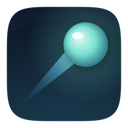
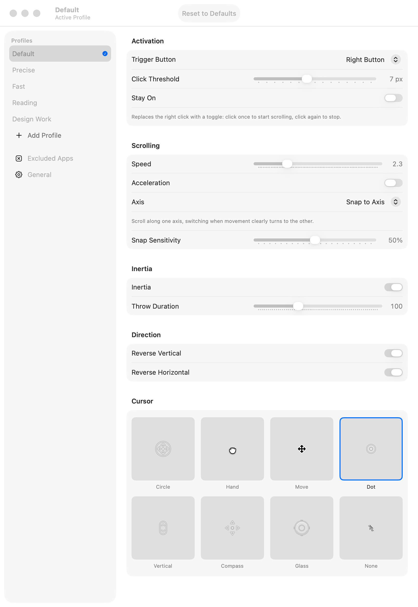
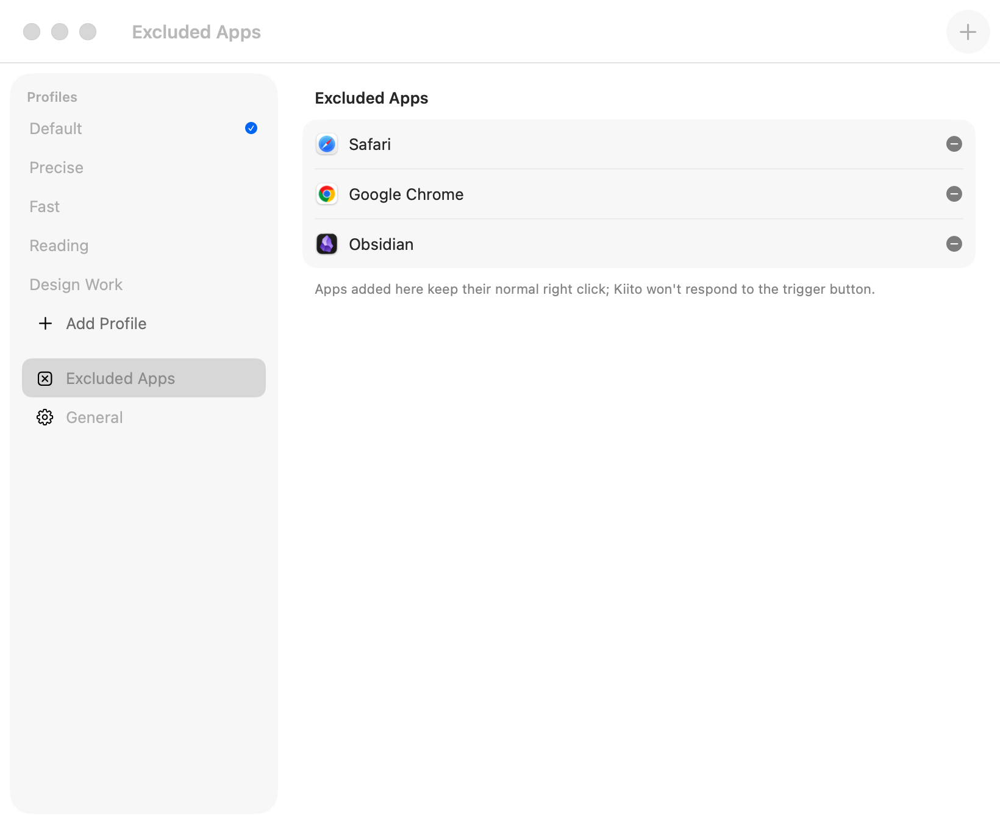

<div align="center">



# Kiito

**Turn a trackball into a scroll wheel. Hold a button, move the ball, scroll. No cursor drift, no subscription.**

<sub>"Kiito" is Finnish for a swift dash, from *kiitää*, to speed along. Roll the ball and the page takes off.</sub>

[](#install)
[](Package.swift)
[](https://www.gnu.org/licenses/gpl-3.0.html)
[](https://github.com/gabry-ts/kiito/releases)

<picture>
  <source media="(prefers-color-scheme: dark)" srcset="docs/screenshots/profile-dark.png">
  
</picture>

</div>

## Why

Trackballs like the Logitech MX Ergo are great pointing devices, but scrolling on them usually means either a dedicated scroll ring or buying one of the paid grab-scroll utilities that already exist for mice and trackballs on macOS. Kiito is a free, open-source alternative built for one job: hold a button, move the ball, scroll, with the cursor frozen so it doesn't drift across the screen while you read.

- **No subscription.** Free and open source.
- **Cursor stays put.** The pointer freezes while you scroll instead of skidding across the screen.
- **A real click still works.** Press and release without moving the ball and it passes through as a normal click.
- **Tuned per app.** Profiles and per-app exclusions mean Kiito only kicks in where you want it.

## Features

| | |
|---|---|
| **Grab-scroll** | Hold a trigger button (right, middle, button 4 or button 5) and move the ball to scroll; release without crossing the movement threshold and it's passed through as a normal click. Optional "Stay On" mode toggles scrolling on and off with a click instead of holding the trigger down. |
| **Tuning** | Adjustable speed and acceleration, axis lock (to stop horizontal drift while scrolling vertically), inertia with a throw duration control, and independent reversal of the vertical and horizontal axes. |
| **Profiles** | Four built-in profiles (Default, Precise, Fast, Reading) tuned for different tasks, plus unlimited custom profiles, switchable from the menu bar. |
| **Cursor** | Eight cursor styles while scrolling: a circular indicator, a closed hand, the system move cursor, a dot, a vertical capsule, a compass, a glass disc, or none at all. |
| **Per-app exclusions** | Apps added to the exclusion list keep their normal right click; Kiito won't respond to the trigger button there. |
| **Menu bar** | Hideable menu bar icon (relaunch Kiito from Spotlight or Finder to bring settings back), launch at login, and a quick enable/disable toggle. |

## Screenshots

<picture>
  <source media="(prefers-color-scheme: dark)" srcset="docs/screenshots/excluded-apps-dark.png">
  
</picture>
<p align="center"><sub>Excluded apps</sub></p>

## Requirements

- macOS 26 or later.
- A trackball or mouse with a spare button to use as the trigger (right, middle, button 4 or button 5).
- Accessibility permission, to install the event tap that intercepts mouse events.

## Install

1. Download the latest `Kiito-<version>.dmg` from [Releases](https://github.com/gabry-ts/kiito/releases) and drag the app to Applications. Kiito uses `SMAppService` for "launch at login", which only works reliably when the app lives in `/Applications`.
2. The app is signed with a local Apple Development identity and **not notarized**, so Gatekeeper blocks the first launch. Open it once, then go to **System Settings > Privacy & Security** and click **Open Anyway** (on older macOS versions, right-click the app > Open also works).
3. Launch Kiito. On first launch it asks for Accessibility permission; grant it in **System Settings > Privacy & Security > Accessibility** and the settings window opens automatically.
4. If a rebuild or reinstall ever invalidates the Accessibility grant, remove and re-add Kiito in that same Accessibility list.

## Reopening settings

Kiito runs as a menu bar app with no Dock icon. If the menu bar icon is hidden, relaunch Kiito from Spotlight or Finder to bring the settings window back.

## Settings location

Profiles, excluded apps and general preferences are stored as JSON at `~/Library/Application Support/Kiito/settings.json`.

## Build from source

Needs Xcode (or the Command Line Tools) with Swift 6.2.

```sh
./scripts/build.sh      # build/Kiito.app
open build/Kiito.app
./scripts/make-dmg.sh   # build/Kiito-<version>.dmg
```

`build.sh` builds a release binary with Swift Package Manager, assembles `build/Kiito.app`, and code-signs it with a local Apple Development identity so the Accessibility grant survives rebuilds. `make-dmg.sh` builds the app if `build/Kiito.app` doesn't exist yet (pass `--rebuild` to force a fresh build) and packages it with `hdiutil`, using only tools that ship with macOS.

## Project structure

```
Sources/Kiito/
  Engine/     event tap, scroll conversion, momentum/inertia, cursor overlay
  Model/      profile and scroll settings, JSON persistence
  System/     accessibility permission, launch at login, window ownership
  UI/         SwiftUI settings window, profile editor, excluded apps list, menu content
scripts/      build.sh, make-dmg.sh
Resources/    Info.plist, app icon, menu bar icon
```

## Uninstall

Quit Kiito, remove it from `/Applications`, and delete `~/Library/Application Support/Kiito` if you want to clear its settings too. If you enabled launch at login, disable it first from Kiito's settings or from System Settings > General > Login Items.

## Privacy

- Settings stay on your Mac, in a local JSON file you can inspect or delete at any time.
- Kiito only reads mouse events and the frontmost app's bundle identifier (to apply per-app exclusions); it doesn't read keystrokes or window content.
- No network access, no analytics, no account, no server of ours.

## Notes

Hiding the system cursor while scrolling relies on an undocumented CoreGraphics connection property (`SetsCursorInBackground`), since a background app cannot otherwise change the global cursor. If that private call is unavailable, Kiito falls back to drawing its cursor overlay on top of the system cursor.

## License

Copyright (C) 2026 Gabriele Partiti

Kiito is free software, released under the [GNU General Public License v3.0](https://www.gnu.org/licenses/gpl-3.0.html).
