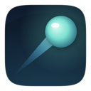
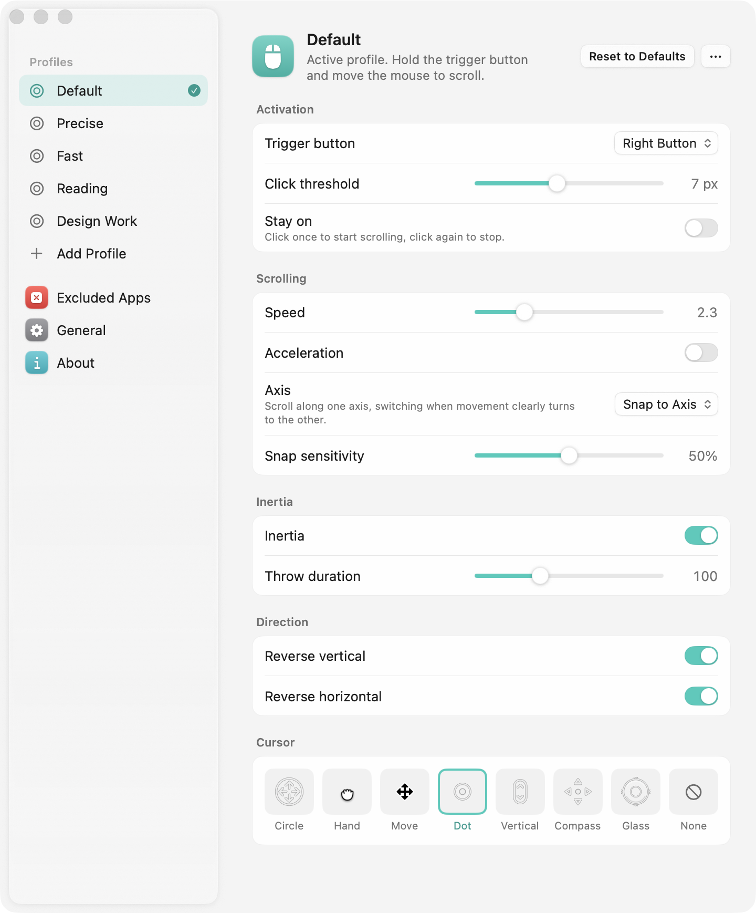

<div align="center">



# Kiito

**Hold a mouse button and move a trackball to scroll. Free and open source. The cursor stays put.**

[](#requirements)
[](Package.swift)
[](https://www.gnu.org/licenses/gpl-3.0.html)
[](https://github.com/gabry-ts/kiito/releases)

<picture>
  <source media="(prefers-color-scheme: dark)" srcset="docs/screenshots/profile-dark.png">
  
</picture>

</div>

## Features

- Grab-scroll: hold a trigger button and move the ball, cursor frozen
- Speed, acceleration, axis lock or snap, inertia and axis reversal
- Four built-in profiles plus unlimited custom ones
- Eight cursor styles while scrolling, or none at all
- Per-app exclusions that keep the normal right click
- Menu bar with a quick toggle and automatic updates via Sparkle

## Install

```sh
brew install --cask gabry-ts/tap/kiito
```

Or download the latest `.dmg` from [Releases](https://github.com/gabry-ts/kiito/releases). Kiito updates itself automatically after that.

## Requirements

macOS 26 or later, Apple Silicon or Intel; a mouse or trackball with a spare button; Accessibility permission for the event tap.

## Build from source

```sh
./scripts/build.sh   # build/Kiito.app
open build/Kiito.app
```

## Privacy

Settings stay on your Mac; Kiito reads mouse events and the frontmost app's bundle ID for exclusions, nothing else.

## License

GNU General Public License v3.0. Copyright (C) 2026 Gabriele Partiti.
